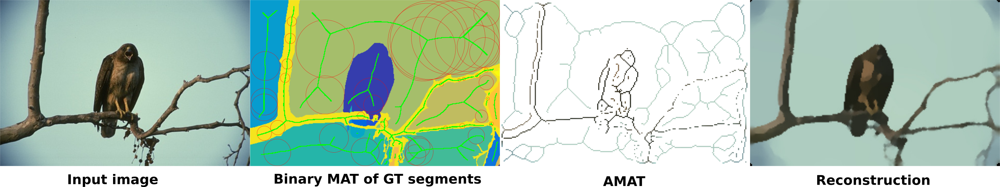

# amat

[AMAT: Medial Axis Transform for Natural Images](https://arxiv.org/abs/1703.08628)  
[Stavros Tsogkas](http://tsogkas.github.io/), [Sven Dickinson](http://www.cs.toronto.edu/~sven/)  
In International Conference on Computer Vision (ICCV), 2017.

## License

This code is released under the MIT License (refer to the LICENSE file for details).

## Contents
1. [Requirements: software](#requirements-software)
2. [Requirements: hardware](#requirements-hardware)
3. [Directory structure](#directory-structure)
4. [Setup](#setup)
5. [Using the code](#using-the-code)
6. [Citation](#citation)

## Requirements: software

* Linux OS (we used Ubuntu 16.04).
* A recent version of MATLAB. All our experiments were performed using MATLAB R2016a.
* [spb-mil](https://github.com/tsogkas/spb-mil) for medial point detection code. 
* [matlab-utils](https://github.com/tsogkas/matlab-utils) for various MATLAB utility functions.
* [inpaint_nans](https://www.mathworks.com/matlabcentral/fileexchange/4551-inpaint-nans?focused=5242309&tab=function) for 2D image inpainting.
* [L0Smoothing code](http://www.cse.cuhk.edu.hk/leojia/projects/L0smoothing/L0smoothing.zip) for edge-preserving image smoothing.

## Requirements: hardware

Our (MATLAB-only) code runs at ~30-40sec for a 256x256 image on a modern desktop CPU. We are working on speeding it up.

## Directory structure
Generally:
* All data should go under `data/`.
* All external code should go under `external/`.
* `amat` results, models etc should go under `output/`.
* Project-specific results and plots are saved in the respective directories of that project. E.g.:
  - spb-mil trained models and medial point detection results are saved in `external/spb-mil/output/models/`. 
  - medial points detection plots are saved in `external/spb-mil/output/plots/`.

Feel free to change the paths in `setPaths.m` and use symbolic links to change directory hierarchy to your preference.

## Setup

1. Clone the `amat` repository: `git clone git@github.com:tsogkas/amat.git`

The code comes with a `startup.m` file that automatically sets up the directory structure and downloads the required packages and data.
Running `startup` or starting MATLAB inside the `amat` folder should be enough.
However, If you want to execute the individual steps included in `startup.m` yourself, do the following: 

2. Create folders `output/`, `external/`, `data/`, `output/models/`.
3. Clone my [spb-mil](https://github.com/tsogkas/spb-mil) repo: `git clone git@github.com:tsogkas/spb-mil.git`   
4. Clone my [matlab-utils](https://github.com/tsogkas/matlab-utils) repo: `git clone git@github.com:tsogkas/matlab-utils.git`
5. Download the [L0Smoothing code](http://www.cse.cuhk.edu.hk/leojia/projects/L0smoothing/L0smoothing.zip) and extract it in `external/`.
6. Download the [inpaint_nans code](https://www.mathworks.com/matlabcentral/mlc-downloads/downloads/submissions/4551/versions/2/download/zip) and extract it in `external/`.
7. Download the [BSDS500](http://www.eecs.berkeley.edu/Research/Projects/CS/vision/grouping/BSR/BSR_bsds500.tgz) dataset and benchmark code and extract it in `data/`.

*NOTE: in some cases MATLAB `websave` function might cause MATLAB to crash. If you face any such problems, please download and extract the BSDS dataset manually.*

## Using the code

* Download the [BMAX500](https://drive.google.com/open?id=0B_bjRXqR9K3OZ0Rub2FGVGlxZDA) annotations.

*BMAX500* is a MATLAB struct that contains annotations for the *training*, and *validation* subsets. Annotations for the test subset will be released in the future.

* Training the spb-MIL:

You can train the spb-MIL medial point detector on BSDS500, with the default options, with the following command:

	trainMIL('trainSet',BMAX500.train);

* Medial point detection experiments:

You can evaluate the performance of the AMAT in medial point detection using the command:
	
	model = testSPB('amat','testSet',BMAX500.val);

Performance statistics are contained in the `model.BMAX500.val.stats` struct.

* Image reconstruction experiments:

You can evaluate the performance of the AMAT and baseline methods, using the command:

	models = testReconstruction({'spbModelPath','gtseg','gtskel','amat'},'testSet',BMAX500.val);

Performance statistics are contained in the `models{i}.BSDS500.val.stats` struct.

## Citation 

If you find our code or annotations useful for your research, please cite our paper [AMAT: Medial Axis Transform for Natural Images](https://arxiv.org/abs/1703.08628):

	@article{tsogkas2017amat,
		Author = {Tsogkas, Stavros and Dickinson, Sven},
		Title = {AMAT: Medial Axis Transform for Natural Images},
		Journal = {ICCV},
		Year = {2017}
	}

  
    

